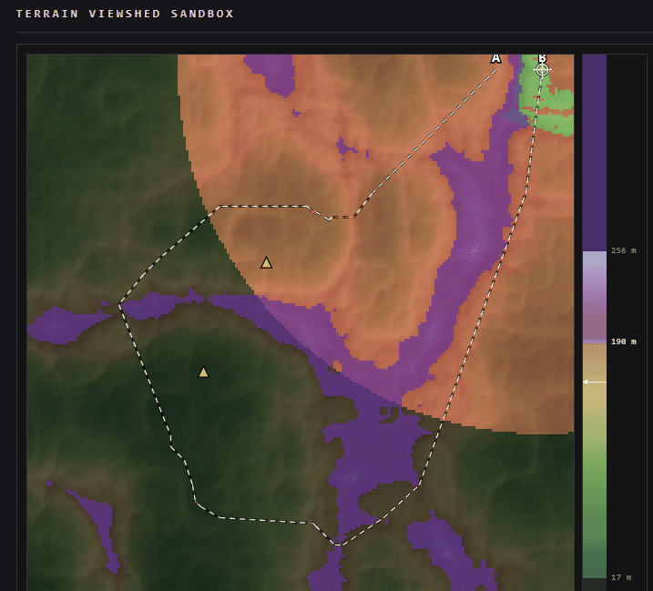
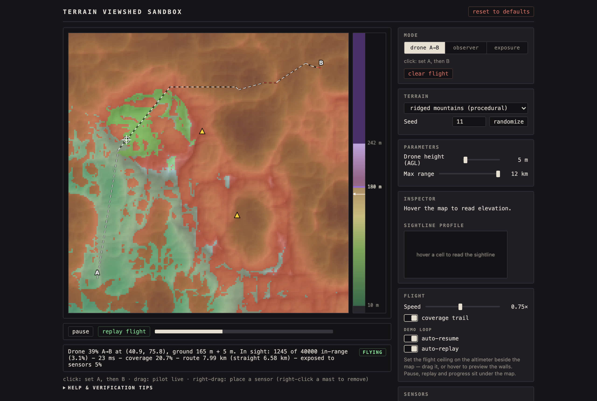

# Terrain Viewshed Sandbox

**Where can you see from here — and where can you be seen from?**



## What it is

A *viewshed* is everywhere you can see from a given point. Stand on a hilltop
and the valley below is in your viewshed; the ground behind the next ridge
isn't. Working them out matters for siting a radio mast, planning a hiking
route, or figuring out where a drone can fly without being spotted.

This is a sandbox for playing with that idea. It generates a synthetic
mountain range, lets you drop an observer anywhere, and paints every cell it
can and can't see — accounting for the curve of the earth and the way the
atmosphere bends light, which is what real line-of-sight analysis has to do.
Then it goes further: fly a drone between two points and watch what it sees
change frame by frame, plant sensor masts and let the drone plan a route that
stays out of their sight.

## Try it

**[Open the live demo →](https://viewshed-6osv.onrender.com/)**

Or clone the repo and `open index.html` — there's no build step and no server.

Three scenarios worth a look, each a single link that restores the whole setup:

| Scenario | What you're looking at |
|---|---|
| [**A drone sortie**](https://viewshed-6osv.onrender.com/#p=ridged&s=11&m=drone&h=5&t=0&r=12000&a=180&sh=10&v=0.75&c=1111&sn=95,70;120,130&A=20,175&B=180,25) | Two sensor masts watching a mountain range. The drone routes around the terrain it can't climb over and the ground the masts can see; legs it can't hide on draw red. |
| [**The curvature horizon**](https://viewshed-6osv.onrender.com/#p=flat&s=1&m=single&h=2&t=0&r=9000&a=180&sh=10&v=0.75&c=1000&o=8,8) | A 2 m observer on a dead-flat plane. The visible region ends in a clean arc at 5.45 km — not a setting, just where the earth curves away. |
| [**Exposure**](https://viewshed-6osv.onrender.com/#p=ridged&s=11&m=inverse&h=2&t=0&r=12000&a=180&sh=10&v=0.75&c=1000&o=100,100) | A position tucked in a valley, showing everywhere it could be watched from. Only 2% of the map — plus two slivers of distant ridgeline with a clear line to it. |

## What's interesting about it

- **The physics is real and checked against closed-form answers.** Sightlines
  drop by `d²/(2·R_eff)` for earth curvature and atmospheric refraction, so on
  a flat plane the visible disk must end at exactly `√(2·R_eff·h)`. The test
  suite asserts that, rather than eyeballing it.
- **43 analytic checks, zero dependencies.** `node test.js` runs the real
  computation functions against ground truth — horizon distance, ridge
  shadowing, grazing at a rounded crest, line-of-sight reciprocity — with no
  test framework and no mocks. Runs in CI on every push.
- **Pathfinding under a 3D constraint.** A flight ceiling turns terrain the
  drone can't climb over into walls; A\* routes around them and string-pulling
  smooths the result into straight legs. Sensor-visible ground is soft-avoided
  at ×8 cost, so the drone detours around watchers when it's cheap to and
  accepts exposure when it isn't.
- **One HTML file.** No libraries, no build step, no backend, no external
  requests. The whole thing is ~2000 lines you can read top to bottom, and the
  computation core is deliberately DOM-free so the tests can run it directly.

## How it works



**Terrain** is a 200×200 grid of 30 m cells — 6 km on a side. Two procedural
presets (rolling fBm hills, ridged multifractal mountains) are seeded, so a
seed always regenerates the same mountains. Two analytic presets (flat plane,
single ridge) exist for verification. Elevation is drawn as a hypsometric tint
over a grayscale hillshade.

**Three modes**, switched at the top of the panel:

- **drone A→B** (the default) — click A then B. The drone flies the planned
  route at a set height above ground and the viewshed recomputes every frame.
  Pause, replay, progress and a countdown sit on the strip under the map.
- **observer** — click a cell, see what it sees.
- **exposure** — click a target and see everywhere it could be seen *from*.
  This is the same viewshed computation run once, not a second algorithm:
  visibility is symmetric under exchange of the two heights.

Switching modes keeps the marked point and reinterprets its role.

**The altimeter** on the map's right edge is the elevation ramp and the flight
ceiling in one instrument. Drag it to set the ceiling; the purple band is the
heights the drone can't clear, and hovering previews those walls on the map. If
A or B themselves sit above the ceiling, it's raised just enough to reach them
and the status line says so.

**Sensor masts** go down with a right-drag (or the *sensors* tool on a touch
screen). Planned flights avoid ground the masts can see, exposed legs draw red,
and a mast flashes while it has a clear line to the drone. Hovering a mast
previews its coverage.

**Every scenario lives in the URL.** The full state — terrain, seed, mode,
heights, ceiling, sensors, endpoints — is in the hash, so any moment can be
bookmarked or sent to someone and it restores exactly, flight and all.

The app has its own help fold with the current gesture list and verification
tips; it's the authoritative reference, since it ships with the build.

## The physics

The part worth getting right, and the reason the analytic presets exist.

- **Earth curvature + refraction.** Every sightline sample drops by
  `d² / (2·R_eff)` with `R_eff = 7/6 × 6371 km` — the classic effective-earth
  model for standard atmospheric refraction. On the flat-plane preset the
  visible disk ends at `√(2·R_eff·h)` (≈ 5.45 km for a 2 m observer), verified
  against the analytic value.
- **Sub-cell sampling.** Rays sample bilinearly-interpolated elevation every
  15 m rather than snapping to cells, so viewshed edges are smooth and
  direction-independent (see the comment on `elevAt` in the source).
- **Heights** sit on top of ground elevation: observer/drone height, target
  height, and sensor mast height are all independent inputs.
- **Reciprocity.** Visibility between two points is symmetric under exchange of
  heights — the property that makes exposure mode a single viewshed call.
  Verified numerically in the test suite.

## Verification

```
node test.js
```

43 checks, no dependencies. The pure computation functions are extracted from
the `<script id="core">` block of `index.html` (kept deliberately DOM-free) and
tested against analytic ground truth: the flat-plane horizon disk, ridge
shadowing, tangent grazing at a rounded crest, LOS reciprocity, seeded-terrain
determinism, pathfinding around synthetic obstacles, stealth-routing detours
vs. crossings, and the union of sensor viewsheds.

The `flat plane` and `single ridge` presets exist for eyeball verification in
the browser — the help fold in the app explains what to look for.

<details>
<summary><b>Full feature reference</b></summary>

- **Terrain**: 200×200 grid, 30 m cells. Seeded procedural presets (rolling
  fBm hills, ridged multifractal mountains) plus two analytic verification
  presets (flat plane, single gaussian ridge). Hypsometric elevation tint over
  a grayscale hillshade, read against the altimeter's elevation ramp. A bare
  open rolls a fresh random seed; URLs carrying a seed reproduce their exact
  terrain.
- **Modes** (a segmented control at the top of the panel)
  - *drone A→B* (the default on open) — the observer flies a planned route at
    a set height above ground; viewshed updates each frame (~5–15 fps,
    synchronous by design).
    The flight strip under the map carries pause/resume, replay, a progress
    bar and a live countdown; a chip by the status line reads planning /
    route pending / flying / paused / landed. A speed slider (0.1×–1.5×,
    default 0.75×) trades pace for detail live. Changing a flight-relevant
    parameter (height, ceiling, range, sensors) mid-flight pauses the drone
    and replans the remaining route from its current position; by default the
    flight auto-resumes ~3 s after the last change and auto-replays 5 s after
    landing (each a toggle), so a shared scenario URL loops as a self-running
    demo. A manual pause always sticks.
  - *observer* — click a cell, see what it sees.
  - *exposure* — inverse viewshed: click a target, see everywhere it can be
    seen **from** (uses LOS reciprocity; zero extra physics).
  - Switching modes keeps the marked point, reinterpreting its role. Target
    height is hidden in drone mode and treated as 0 there, so a control that
    isn't shown can't silently shape the field.
- **Altimeter**: the elevation ramp and the flight ceiling fused into one
  vertical instrument on the canvas's right edge. It maps 0–400 m; the
  hypsometric ramp colours the terrain's elevation band, and in drone mode a
  purple band marks the heights above the ceiling (the walls) with a draggable
  thumb, plus a tick at the live eye altitude. Hovering it previews the walls
  on the map. Below 900 px it demotes to a horizontal *Flight ceiling* slider
  under the map.
- **Pathfinding**: the flight ceiling (set on the altimeter) makes tall
  terrain impassable, and the drone plans an A\* route around those walls,
  smoothed into straight legs by string-pulling. If A or B themselves sit
  above the ceiling, the effective ceiling is raised just enough to reach them
  and the status line notes it. While a route is being planned (before launch)
  the map shows the walls on its own as a purple contour outline, plus sensor
  coverage as a pale orange fill; the green/red viewshed overlay arrives with
  the launch. Hovering or dragging the altimeter, or adjusting the mast-height
  slider, still previews either layer at full strength. No route under the
  ceiling → route pending: A and B stay on the map joined by a dashed red
  line, every parameter change retries the plan, and the flight takes off by
  itself ~3 s after a route appears (with auto-resume on; otherwise it waits
  for *replay flight*). A mid-flight change that walls off B freezes the drone
  in place in the same pending state — coverage intact — and it resumes the
  sortie once a route reappears. A shared URL can carry an unsolvable scenario
  that starts flying the moment the viewer raises the ceiling.
- **Sensors & stealth**: with a mouse, hold the right button to place a sensor
  mast — it follows the cursor and commits on release; right-drag a mast to
  move it, plain right-click to remove it. On a touch screen, switch the tool
  above the map to *sensors* and tap to place, drag to move, tap a mast to
  remove. While placing, while hovering a mast (tapping one on touch), and
  while hovering or adjusting the mast-height slider, an orange preview shows
  the union of sensor viewsheds (what the masts see). Planned flights softly
  avoid terrain the sensors can see (cost ×8); exposed route legs draw red, and
  masts flash red live while they have a clear sight line to the drone.
  Coverage-trail toggle accumulates everything seen during a flight.
- **Sightline profile**: hover any cell (with an observer set) for a
  cross-section showing the curved-earth ground, the line of sight, and the
  exact sample that blocks it, in the Inspector section.
- **Gestures**: click/tap (place), drag (pilot the observer/drone live),
  right-drag or the touch *sensors* tool (place/move a mast), right-click or
  tap a mast (remove it). Listed under the map per mode.
- **Layout**: the map sits in a well with the altimeter on its right edge, a
  flight strip beneath it, and a sidebar of grouped sections (Mode, Terrain,
  Parameters, Flight, Sensors, View, Inspector). Below 900 px it reflows to one
  column with the sections as accordions and a touch tool switcher.

</details>

<details>
<summary><b>Implementation notes</b></summary>

- One file; the core physics/algorithms live in a DOM-free script block so the
  node tests can eval them directly.
- Everything is synchronous — no workers. A full 200×200 viewshed costs
  ~100–250 ms; flights advance by wall-clock time so choppiness never changes
  the drone's ground speed.
- A\* runs once per launch (~15 ms) — routing is never the bottleneck.
- The URL hash schema is frozen (`p s m h t r a sh v c sn A B o`), so links
  shared from older versions keep resolving.

</details>

## License

MIT — see [LICENSE](LICENSE).

## Notes

Built with AI assistance, from a written spec. The physics requirements
(curvature and refraction, sub-cell sampling with a justification in the
source), the two analytic verification presets, and the single-file
no-dependency constraint were all fixed up front — and `test.js` is how the
result was held to them.
